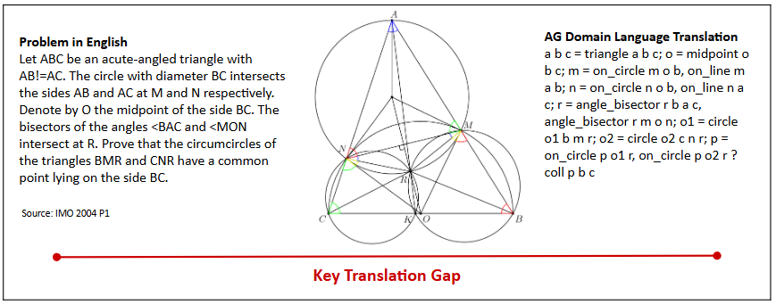
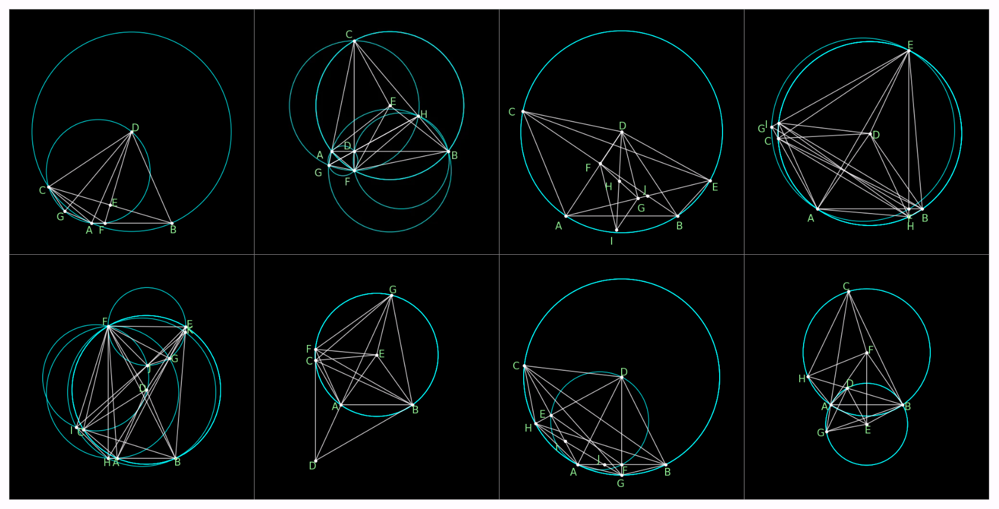

# NL2AGBench: Benchmarking LLM Auto-Formalization for AlphaGeometry
Repo for "NL2AGBench: Benchmarking LLM Auto-Formalization for AlphaGeometry"


*Figure 1: The translation gap between natural-language geometry problems and AlphaGeometry's formal DSL. While AlphaGeometry has demonstrated strong theorem-proving capabilities, the manual formalization step remains a major barrier to usability and large-scale deployment.*

## 💡 Introduction

AlphaGeometry is one of the most successful neuro-symbolic systems for Olympiad-level geometry reasoning, solving 25 of 30 historical IMO geometry problems. However, it requires every problem to be hand-translated into a specialized domain-specific language (DSL) before it can run — a manual bottleneck that limits accessibility and large-scale use.

**NL2AGBench** evaluates whether large language models can close this gap by translating English geometry problems directly into AlphaGeometry-compatible formal representations. Rather than scoring translations with textual similarity metrics, NL2AGBench verifies them by **execution**: every generated translation is run inside AlphaGeometry itself, so a "correct" answer means the DSL actually parses, constructs, and produces a valid problem specification — not just that it looks plausible.

## 📏 Benchmark Construction

NL2AGBench is built from geometry problems originally formalized for AlphaGeometry:

- **Source**: The Java Geometry Expert (JGEX) repository, from which the AlphaGeometry project manually formalized 231 problems into its DSL.
- **Selection**: 48 representative problems were selected for translation diversity (circles, cyclic quadrilaterals, angle bisectors, orthocenters, circumcenters, midpoints, reflections, perpendicular constructions) and execution efficiency (excluding problems with excessive AlphaGeometry runtime).
- **Format**: Every problem pairs a natural-language statement with a verified, executable AlphaGeometry translation.


*Figure 2: Sample NL2AGBench problems spanning a range of geometric concepts, selected for both diversity and runtime efficiency.*

### Evaluation Objective

Given a natural-language geometry problem $P_{NL}$, a model $f_\theta$ must generate a formalization $P_{AG}$:

$$f_\theta(P_{NL}) \rightarrow P_{AG}$$

A translation is **successful** if and only if it executes in AlphaGeometry without error and produces a valid problem specification — satisfying both:

- **Syntactic correctness** — conforms to AlphaGeometry grammar
- **Semantic correctness** — preserves all geometric objects, constraints, and target conclusions from the original problem

## 🧩 Error Taxonomy

AlphaGeometry's raw execution failures are often low-level and hard to interpret. NL2AGBench introduces a taxonomy that maps these failures into two interpretable categories:

**Syntax Errors** — the DSL violates structural/grammatical requirements:
- `AssertionError` — wrong number of arguments to a construction (e.g., `reflect` given 2 points instead of 3)
- `KeyError` — misused clauses, delimiters, or special characters (e.g., malformed `circumcenter` usage, a stray `;` before `?`, hallucinated clauses)
- `ValueError` — circular or self-referential point definitions, or incorrect parameter counts for proof predicates (e.g., `eqangle` given 12 arguments instead of 8)

**Logic Errors** — the DSL is syntactically valid but semantically wrong (e.g., asserting a perpendicularity that the construction doesn't actually produce). These are detected via execution timeout/freeze rather than a raised exception.

This taxonomy lets us diagnose *why* a model failed — DSL unfamiliarity vs. genuine geometric misunderstanding — rather than reporting a single pass/fail rate.

## 📊 Evaluation

We evaluate **10 state-of-the-art LLMs** (closed- and open-source, spanning multiple parameter scales) in a zero-shot setting.

**Table 1. Zero-Shot Model Performance**

| Closed Source | Correct | Open Source | Correct |
|---|---|---|---|
| GPT-5.4 | 75.00% | Qwen3:235B | 12.50% |
| Gemini 3.1 | 62.50% | Llama3.1:70B | 0% |
| Grok-3 | 52.08% | Llama3.2:3B | 0% |
| Sonnet 4.6 | 37.50% | Mistral:7B | 0% |
| GPT-4o:8B | 4.17% | Nemotron-3 Nano:4B | 0% |

A substantial gap separates frontier closed-source models from open-source alternatives: the strongest closed-source models exceed 80% with mitigation (see below), while even the largest open-source models struggle to consistently preserve geometric constraints.

## 🚀 Improving Translation Performance

We investigate three mitigation strategies on top of the zero-shot baseline.


*Figure 3: Model performance under zero-shot vs. few-shot prompting.*

### Few-Shot Prompting
Each model is given 54 paired natural-language/DSL reference examples. This is the most effective and scalable strategy, improving nearly every model:

- **Gemini 3.1**: +21 pts
- **GPT-5.4**: +4 pts
- **Grok-3**: +4 pts
- **Sonnet 4.6**: +14 pts
- **Qwen3:235B**: +33 pts (>3x relative improvement)
- **Llama3.1:70B**: +23 pts
- Mistral:7B, Nemotron-3 Nano:4B, and Llama3.2:3B produce no correct translations in either setting.

The largest relative gains come from open-source models, and improvements are concentrated in syntax errors — suggesting many failures stem from DSL unfamiliarity rather than a lack of geometric understanding.

### Human-Guided Hints
A two-stage correction framework: (1) a geometric diagram is provided to resolve spatial ambiguity, followed by (2) targeted, error-specific hints addressing the model's prior mistake. This improves frontier models substantially — **GPT-5.4** +14.29%, **Gemini 3.1** +14.63%, **Sonnet 4.6** +26.47%, **Grok-3** +32.14% — but doesn't scale, since it requires manual inspection of each output.

### Supervised Fine-Tuning
Smaller open-source models are fine-tuned on HAGeo-409, a human-verified geometry/AlphaGeometry-translation dataset. Fine-tuning improves syntactic conformity but yields limited gains in semantic/executable accuracy — fine-tuned models often learn surface-level DSL patterns without reliably capturing the underlying geometric semantics.

## 🔭 Future Work

- Extend NL2AGBench to additional theorem-proving systems beyond AlphaGeometry
- Incorporate geometric diagrams directly via multimodal formalization
- Develop specialized auto-formalization models rather than relying on general-purpose LLMs
- Integrate symbolic execution feedback for iterative self-correction

## ☕️ Citation

If you find this benchmark helpful, please consider citing our paper:

```bibtex
@misc{nl2agbench2026,
      title={NL2AGBench: Benchmarking LLM Auto-Formalization for AlphaGeometry},
      author={Samuel Xiao and Judy Song and Rory Hu and Ziliang Zong},
      year={2026},
}
```

## Acknowledgements

NL2AGBench builds on the original [AlphaGeometry](https://github.com/google-deepmind/alphageometry) system and problem set, and draws reference translations from the [HAGeo-409](https://huggingface.co/datasets/HAGeo-IMO/HAGeo-409) benchmark.
